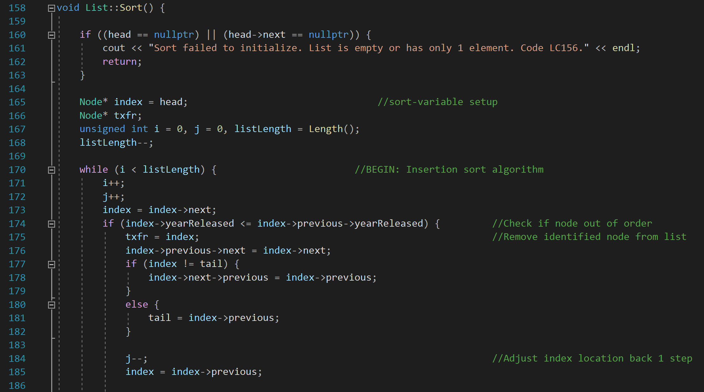
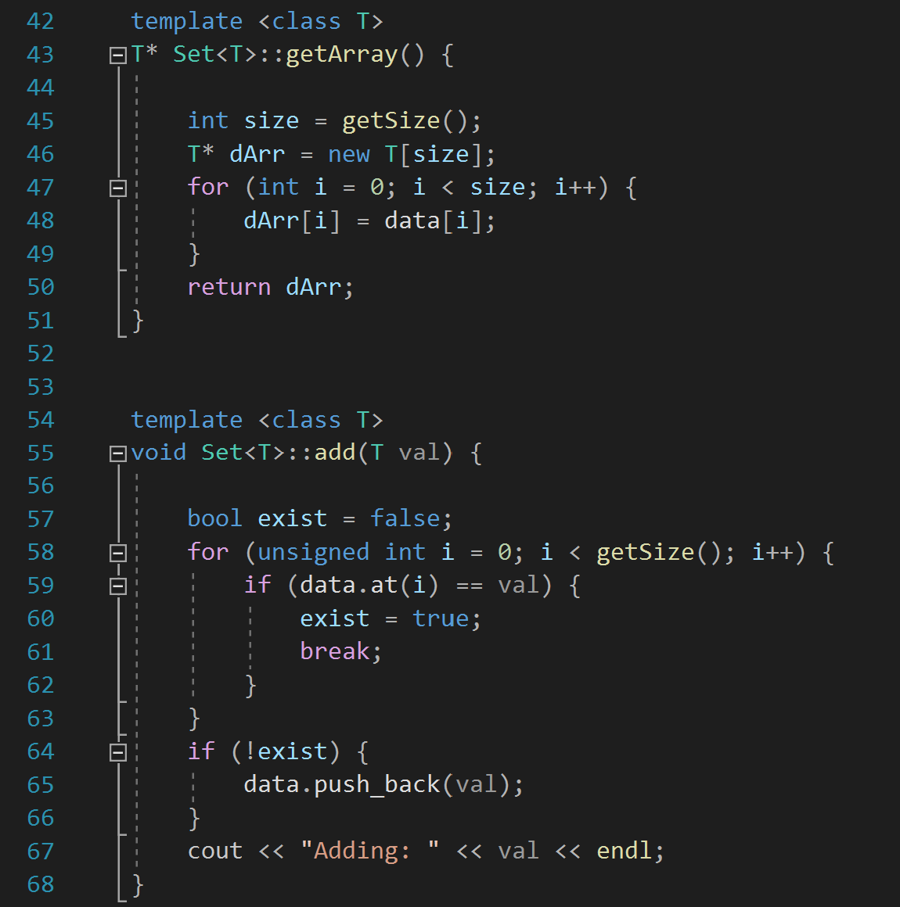

<table>
 <tr>
  <td><h1>SPENCER HISCOX&nbsp&nbsp&nbsp&nbsp&nbsp&nbsp&nbsp&nbsp&nbsp&nbsp&nbsp&nbsp&nbsp&nbsp&nbsp&nbsp&nbsp&nbsp&nbsp&nbsp&nbsp&nbsp&nbsp&nbsp&nbsp&nbsp&nbsp&nbsp&nbsp&nbsp&nbsp&nbsp</h1></td>
  <td><a href="https://www.linkedin.com/in/spencerhiscox/">https://www.linkedin.com/in/spencerhiscox</a></td>
 </tr>
</table>
 

<!--{width=150 height=150}-->
<h3>HONOURS MECHANICAL ENGINEERING, UNIVERSITY OF WATERLOO</h3> 

<h3>ABOUT</h3>
I was Born to be an Engineer.  

I've always had an insatiable curiosity and a relentless desire to understand the intricacies of how things work and why. I love problem-solving and I'm obsessed (obsessively) with optimization. Whether it's coding, mechanical design, hardware, or pure sciences, I'm constantly seeking new challenges and opportunities to learn and grow. <a href="https://www.linkedin.com/in/spencerhiscox/#about" target="_blank">...Read More...</a>
   

<h3>CS SPECIFIC SKILLS / EXPERIENCE</h3>

<table>
 <ul>
 <tr>
  <td><h3>LANGUAGES</h3></td>
  <td><h3>SOFTWARE</h3></td></tr>
 <tr>
  <td><li>Python</li></td>
  <td><li>Visual Studio 2019</li></td></tr>
 <tr>
  <td><li>C++</li></td>
  <td><li>Wing101</li></td></tr>
 <tr>
  <td><li>C</li></td>
  <td><li>LabView</li></td></tr>
 <tr>
  <td><li>MATLAB</li></td>
  <td><li>MATLAB</li></td></tr>
 </ul>
</table>

<table>
 <tr>
  <td><a href="https://github.com/spencerhiscox?tab=repositories"><h3>PROJECTS</h3></a></td>
 </tr>
 <tr>
  <td>
<a href="https://github.com/spencerhiscox/TRUSS-ty-CALC/blob/master/TRUSS-ty-CALC_v1.3.4.py">  <b>Truss Geometry Optimization Utility (Python)</b></a> 
    <i>Iteratively solves internal forces of each truss member for four truss types across a range of angles at coarse (δ = 1 degree) resolution, assigning HSS geometries to minimize cost (material usage). Calculates each truss' total weight and recursively passes over identified low-point of distribution, increasing resolution by an order of magnitude on each pass. Visualizes optimization passes graphically for review, identifies and stores the optimal geometry for each truss type and returns the optimal truss type and geometry. Coded for function call tracing diagnostics and cross-validation.</i> 
    <ul>
    <li>TUI</li>
    <li>Dependency Inversion Interface</li>
    <li>Recursive Algorithms</li>
    <li>Data Visualization / Manipulation</li>
    <li>Dynamic Multi-pass Optimization</li>
    <li>Classes / Methods</li>
    <li>State Variables</li>
    <li>Cross-Validation</li>
    <li>Function Call Tracing</li>
    <li>File I/O</li>
    <li>Arbitrary Argument Lists</li>
    </ul>
  </td>
  <td>
   Written: 03/2023
   
   
  </td>
 </tr>
 <tr>
  <td>
   <a href="https://github.com/spencerhiscox/LinkedList-InsertionSort-BIT2400/blob/master/List.cpp">  <b>CA-VI: Sorting Algorithms (C++)</b></a> 
    <i>Implementation of doubly linked list data structure with limited searchability / sortability. "List" and "Node" classes were created to house the overall database and individual entries, respectively, with any built-in functionality of the data structure implemented as methods of the List class. An alphabetical sort algorithm was nested inside an insertion sort algorithm, both written from scratch. Common functions such as popback(), peekfront() etc. were also defined under the List class.</i> 
    <ul>
    <li>Dynamic Allocation</li>
    <li>Doubly Linked List</li>
    <li>Insertion Sort</li>
    <li>Alphabetical Sort</li>
    </ul>
  </td>
  <td>
   Written: 04/2022
   
  </td>
 </tr>
 <tr>
  <td>
   <a href="https://github.com/spencerhiscox/ClassTemplates-BIT2400/blob/master/Set.h">  <b>CA-V: Class Templates & Vectors (C++)</b></a> 
    <i>Ipsum Lorem.</i> 
    <ul>
    <li>TUI</li>
    <li>Dependency Inversion Interface</li>
    <li>Recursive Algorithms</li>
    <li>Data Visualization / Manipulation</li>
    <li>Dynamic Multi-pass Optimization</li>
    <li>Classes / Methods</li>
    <li>State Variables</li>
    <li>Cross-Validation</li>
    <li>Function Call Tracing</li>
    <li>File I/O</li>
    <li>Arbitrary Argument Lists</li>
    </ul>
  </td>
  <td>
   Written: 03/2022
   
  </td>
 </tr>
 <tr>
  <td>
- [CA-VII: Data Visualization (C, F2021)](https://github.com/spencerhiscox/C_data_vis_y1_assignment_7)
  </td>
  <td>
   
  </td>
 </tr>
 <tr>
  <td>
- [CA-VIII: Chance Game / ASCII Art (C, F2021)](https://github.com/spencerhiscox/C_game_y1_assignment_8)
  </td>
  <td>
   
  </td>
 </tr>
 <tr>
  <td>
- [Task Organizer <Python, current WIP>](https://github.com/spencerhiscox/dates_viewer)
  </td>
  <td>
  
  </td>
 </tr>
 </table>

<!--
**InochiFumetsu/InochiFumetsu** is a ✨ _special_ ✨ repository because its `README.md` (this file) appears on your GitHub profile.

Here are some ideas to get you started:

- 🔭 I’m currently working on ...
- 🌱 I’m currently learning ...
- 👯 I’m looking to collaborate on ...
- 🤔 I’m looking for help with ...
- 💬 Ask me about ...
- 📫 How to reach me: ...
- 😄 Pronouns: ...
- ⚡ Fun fact: ...
-->
